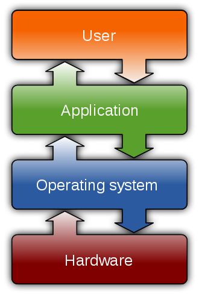

# Overview

**Memory management** is a form of [resource management](https://en.wikipedia.org/wiki/Resource_management_%28computing%29) applied to [computer memory](https://en.wikipedia.org/wiki/Computer_memory). The essential requirement of memory management is to provide ways to dynamically allocate portions of memory to programs at their request, and free it for reuse when no longer needed. This is critical to any advanced computer system where more than a single [process](https://en.wikipedia.org/wiki/Process_%28computing%29) might be underway at any time.[\[1\]](https://en.wikipedia.org/wiki/Memory_management#cite_note-1)

Several methods have been devised that increase the effectiveness of memory management. [Virtual memory](https://en.wikipedia.org/wiki/Virtual_memory) systems separate the memory addresses used by a process from actual physical addresses, allowing separation of processes and increasing the size of the [virtual address space](https://en.wikipedia.org/wiki/Virtual_address_space)beyond the available amount of [RAM](https://en.wikipedia.org/wiki/Random-access_memory) using [paging](https://en.wikipedia.org/wiki/Paging) or swapping to [secondary storage](https://en.wikipedia.org/wiki/Secondary_storage). The quality of the virtual memory manager can have an extensive effect on overall system performance.

### Dynamic memory allocation

The task of fulfilling an allocation request consists of locating a block of unused memory of sufficient size. Memory requests are satisfied by allocating portions from a large pool of memory called the heap or free store.[\[note 1\]](https://en.wikipedia.org/wiki/Memory_management#cite_note-2) At any given time, some parts of the heap are in use, while some are "free" \(unused\) and thus available for future allocations.

Several issues complicate the implementation, such as [external fragmentation](https://en.wikipedia.org/wiki/Fragmentation_%28computer%29#External_fragmentation), which arises when there are many small gaps between allocated memory blocks, which invalidates their use for an allocation request. The allocator's [metadata](https://en.wikipedia.org/wiki/Metadata_%28computing%29) can also inflate the size of \(individually\) small allocations. This is often managed by [chunking](https://en.wikipedia.org/wiki/Chunking_%28computing%29). The memory management system must track outstanding allocations to ensure that they do not overlap and that no memory is ever "lost" \(i.e. that there are no "[memory leaks](https://en.wikipedia.org/wiki/Memory_leak)"\).

